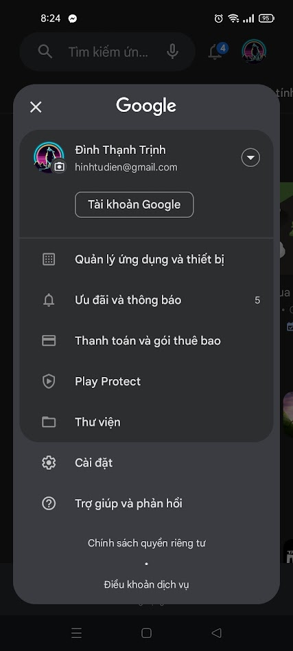
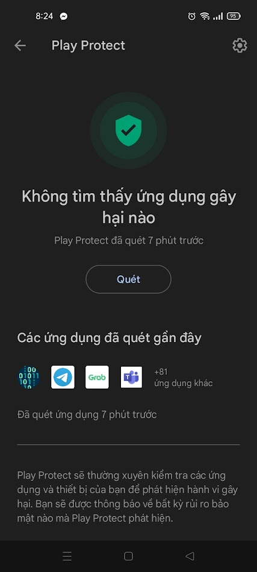
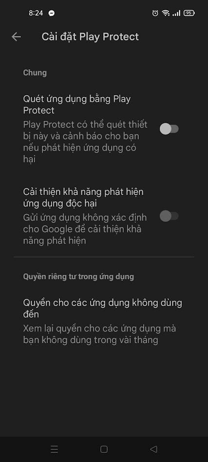

1. Author: Trinh Dinh Thanh - 21200354, Faculty of Electronic and Telecommunication, HCMUS - VNUHCM.
2. Description: Q.McCluskey solver is an Android app to implement Quine McCluskey algorithm to simply logical expressions. Q.McCluskey Solver is developed by React Native framework and Typescript.
   The UI is cloned from https://geeekyboy.github.io/Quine-McCluskey-Solver/
3. Installing:

Step 1: Download file quine-mccluskey-solver.apk .
Step 2: Turn off Play Protect in mobile phone:

- Go to CH Play
- Pick Play Protect
  
- Press the gear in the top-right corner of screen to open Play Protect settings.
  
- Turn off all switches.
  

Step 3: Install Q.McCluskey Solver from quine-mccluskey-solver.apk
Step 4: After installing successfully, you can turn on Play Project.
